RAPSODE Jomalhia
RAMANOELINA Neil-Matthieu
DSIA-4101A

Projet Dashboard Python

# 1.	INTRODUCTION

Le module "*Python & Datavisualisation*", se conclut par la réalisation d'un projet dans lequel nos connaissances en Python seront mise en application pour l'étude du sujet choisit. Ce projet a été effectué en binôme par **Neil-Matthieu RAMANOEILNA** et **Jomalhia RAPSODE**.

Ce projet consiste à développer une interface dite Single Page Application ou encore Multi Page Application à partir d’une base de données. Notre thème principal porte sur l’étude des catastrophes naturelles  et sur différents facteurs climatiques notamment la température. Notre problématique est la suivante :

# En quoi la température est-elle un facteur pouvant influencer les catastrophes naturelles ?

Pour répondre à cette question nous avons utilisé des bases de données open source et le langage de programmation Python. L’objectif que nous nous sommes fixé est de déterminer si la température a une influence sur les catastrophes naturelles.

Les jeux de données sur lesquels nous avons choisi travailler sont les suivants:

*[Arrêtés de catastrophe naturelle en France métropolitaine](https://www.data.gouv.fr/fr/datasets/arretes-de-catastrophe-naturelle-en-france-metropolitaine-2/)*
  > *source: data.gouv.fr*
  
- * [Température quotidienne régionale (depuis janvier 2016) ](https://www.data.gouv.fr/fr/datasets/temperature-quotidienne-regionale-depuis-janvier-2016/)*
  > *source: data.gouv.fr*

# 2.	GUIDE UTILISATEUR

## 2.1.	Technologies 

-	Python	version  3.7.4

### 2.1.1       Installation

#### 2.1.1.1    Python

  Afin d'exploiter notre projet, il est nécessaire premièrement d'installer le langage "*Python 3.7.4*". 
  Nous vous conseillons d'installer le package "*Anaconda3*".

#### 2.1.1.2	Packages

-	pandas 		    			version 1.0.5

La librairie ***pandas*** permet de manipuler et d'analyser les données aisément, notamment des structures de données et des opérations de manipulation de tableaux numériques et de séries temporelles.

-	json 						version 2.0.9

La librairie ***json*** permet la lecture et l'écriture de documents dont l'extension est JSON.

-	datetime 					version 4.3

Le moodule ***datetime*** permet de manipuler les dates et heures sur Python

-	urllib.request  			version 3.8

Le module ***urllib.request*** permet d'ouvrir des URLs dans un environnement complex.

-	dash						version 1.17.0

La librairie ***dash*** permet de construire des Applications Web d'Analyse

-	dash_core_components 		version 1.13.0

La librairie ***dash_core_components*** donne accès à des composants complex comme des dropdown ou des sliders.

-	dash_html_components		version 1.1.1

Le module ***dash_html_components*** contients des composants html.

-	dash_bootstrap_components	version 0.10.7

Le module ***dash_bootstrap_components*** est une librairie utilisée dans Plotly Dash.

-	dash.dependencies

-	plotly						version 4.12.0

La librairie ***plotly*** sert implémenter une interface web et des dashboards sans avoir à utiliser de langage HTML ou d'autre lagage web.

-	plotly_express				version 0.4.1

La librairie ***plotly_express*** permet de créer la plus part des graphiques communs.

-	plotly.io

La librairie ***plotly.io*** permet d'afficher d(afficher figure sen utilisant des Renderers framework/)

-	plotly.graph_objects		version 

Le module ***plotly.graph_objects*** fournit une hiérarchie de classe appelé "graph objects" qui peuvent être utilisé pour représenter des graphiques.

La commande ci-dessous permet d’installer les différents packages cités précédemment directement dans le terminal:
	> pip install nom_du_package

## 2.2.	Exécution

Pour lancer ce projet, il est nécessaire de :

Méthode 1:
•	Télécharger le dossier.
•	Ouvrir le fichier « global.py» avec Visual Studio Code.
•	Lancer l’application grâce au bouton Run de Python ou à la commande:

> python main.py

•	Le dashboard s’ouvrira dans une fenêtre dans un navigateur internet.

Méthode 2:
•	Se rendre sur git.
•	Cloner le fichier afin d’avoir une copie sur votre machine personnelle :

> https://git.esiee.fr/rapsodej/projet-dashboard-python.git

•	Puis l‘ouvrir et le lancer sur Visual Studio Code grâce au bouton «  Run  »  ou à la commande:

> python main.py

•	Le Dashboard s’ouvrira dans une fenêtre.

# 3.	GUIDE DEVELOPPEUR

## 3.1.	Fichiers

Voici une présentation des fichiers utilisés dans ce projet :

### 3.1.1 « global.py»

•	Le fichier  « global.py » contient le code permettant de nettoyer les données. En effet, si l’utilisateur souhaite modifier les données permettant d’afficher les graphiques, il peut le faire dans « global.py ».

### 3.1.4 Jeux de données

*[Arrêtés de catastrophe naturelle en France métropolitaine](https://www.data.gouv.fr/fr/datasets/arretes-de-catastrophe-naturelle-en-france-metropolitaine-2/)*
  > *source: data.gouv.fr*

- * [Température quotidienne régionale (depuis janvier 2016) ](https://www.data.gouv.fr/fr/datasets/temperature-quotidienne-regionale-depuis-janvier-2016/)*
  > *source: data.gouv.fr*

### 3.1.5  dossier image 

Ce dossier contient toutes les images auxquels il est sera fait référence de ce document

## 2.3. DASHBOARD

On peut naviguer au travers de notre application grâce au menu :

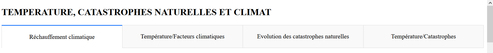

Il y a quatre pages:
- *Réchauffement climatique*
- *Température/différents facteurs*
- *Catastrophes naturelles*
- *Temperature/Catstrophes*

### 2.3.1 Page 1 Réchauffement climatique ou non ?

La première page nous permet de montrer grâce à notre jeu de données qu'on observe bien une augmentation des températures, au fil du temps. 

### 2.3.2 Page 2 

 
Sur la deuxième page, on établit une corrélation entre la température et différents facteurs: l’ensoleillement, la hauteur des précipitations et la vitesse maximale du vent.

### 2.3.3 Page 3

La troisième page met en oeuvre l’évolution des catastrophes naturelles par région et par type selon les années.

### 2.3.3 Page 4

Enfin la quatrième page nous permet de comprendre si les catastrophes naturelles sont liées à l’évolution de la température, en réalisant une étude entre 2016 et 2020

# 3.	GUIDE DEVELOPPEUR

## 3.1.	Fichiers

Voici une présentation des fichiers utilisés dans ce projet :

### 3.1.1 « global.R »

•	Le fichier  « global.py » contient le code permettant de nettoyer les données. En effet, si l’utilisateur souhaite modifier les données permettant d’afficher les graphiques, il peut le faire dans « global.py ».

### 3.1.2 Jeux de données

- *[Arrêtés de catastrophe naturelle en France métropolitaine](https://www.data.gouv.fr/fr/datasets/arretes-de-catastrophe-naturelle-en-france-metropolitaine-2/)*
  > *source: data.gouv.fr*

- *[Température quotidienne régionale (depuis janvier 2016) ](https://www.data.gouv.fr/fr/datasets/temperature-quotidienne-regionale-depuis-janvier-2016/)*
  > *source: data.gouv.fr*

### 3.1.3  dossier image 

Ce dossier contient toutes les images auxquels il est sera fait référence de ce document.

# 4.	RAPPORT D'ANALYSE 

## 4.1.	 Page 1

Dans un premier temps, la première page de notre Dashboard nous permet d’avérer ou d’infirmer, par la visualisation, une augmentation des températures au cours des cinq dernières années.

### 4.1.1  Moyenne des températures par Région

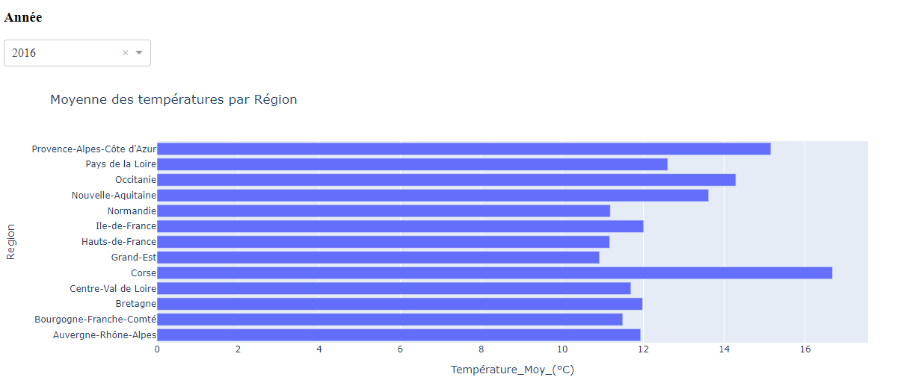

En outre la première représentation intitulée Moyenne des températures par Région, nous permet de voir une hausse de la température au fil des années malgré une légère diminution en 2018. On constate, que la température en 2017 augmente pour toutes les régions sauf pour la Corse où la température baisse légèrement .

A l’aide du diagramme Année, il est possible de modifier l’aspect du graphique “Moyennes de températures par Région”, en effet, il suffit de déplacer le curseur de gauche à droite pour passer d’une année à une autre.
 
En 2018, la température augmente puis diminue en 2019 pour toutes les régions. On connaît une forte augmentation des températures en 2020, cette observation s’explique du fait que les bases de données de températures ne sont pas encore complètes puisque l’année n‘est pas encore terminée.

### 4.1.1. Ecart de température rapport à la normale de saison 

 
Pour avoir une vue moins globale des températures au cours de l’année nous avons choisi de représenter graphiquement les écarts de températures en fonction des différentes saisons. Nous comparons ici la moyenne de température saisonnière à la normale de saison. 

#### 4.1.1.1. Ecart de température rapport à la normale de saison- Automne 13.1°c

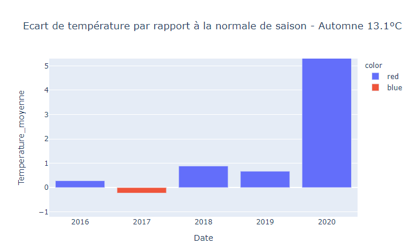

En Automne les températures sont supérieures à la normale sauf en 2017 où il y a une légère baisse. De plus, l’écart de température en automne 2020 est très important ce qui s’explique par l’automne n’est pas terminé. 

#### 4.1.1.2. Ecart de température rapport à la normale de saison - Hiver 5.4°c

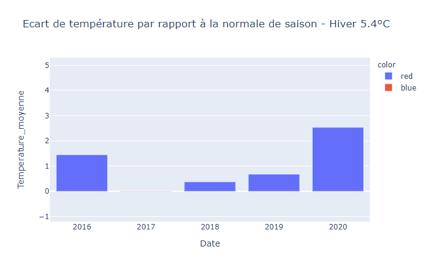

Pour l’Hiver, on remarque un écart très élevé en 2016 contrairement à l’année 2017 où l’écart est infime voire nul. De 2018 à 2020 on remarque que la différence de température augmente, elle est de 2,6°C pour l’année en cours.

#### 4.1.1.3. Ecart de température rapport à la normale de saison - Printemps 11.6°c
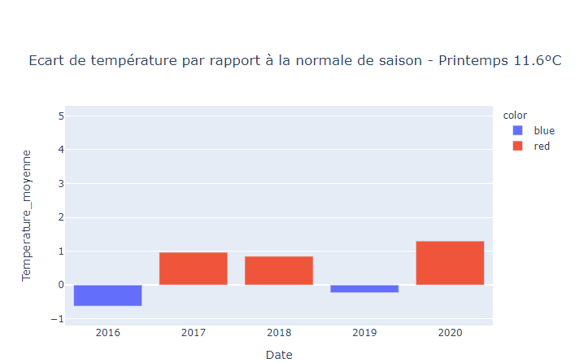

Au printemps, on remarque que les températures sont basses en 2016 et en 2019 par rapport à la normale de saison. 

#### 4.1.1.4. Ecart de température rapport à la normale de saison - Eté 19.9°c

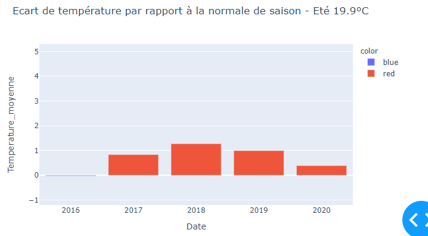
Enfin, on remarque une baisse des écarts en les étés 2018 et 2020 malgré un écart de température positif en 2017. 

Ainsi globalement, on observe que l’écart entre les températures et les normales de saison demeure positif.

### Temperature par mois

Afin d’avoir une vison plus précise on réduit l’échelle de temps et on regarde l’évolution de la température en fonction des mois de l’année. De décembre à février la médiane de température à tendance à augmenter sauf en 2017 où elle diminue. De même, entre mars et mai la médiane augmente à l’exception de 2019 où elle diminue légèrement. On peut relier cette diminution à l’écart négatif à la normale de saison du printemps 2019. Entre juin et août la médiane suit l’évolution des écarts de températures par rapport à la normale de saison. Il en est de même entre septembre et novembre.

## 4.2.	 Page 2

Dans un second temps, la page deux du Dashboard permet de relier l’évolution de la température à divers facteurs.

### 4.2.1 Vitesse du vent maximale/Temperature

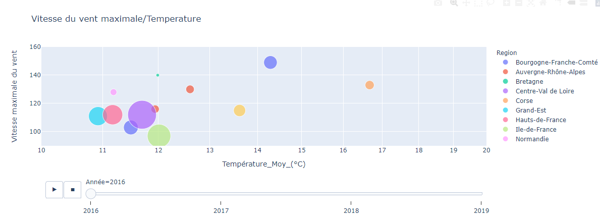

Pour les régions d'Occitanie, de Provence-Alpes-Côte d’Azur et de Nouvelle Aquitaine on remarque une augmentation de la vitesse du vent avec l’augmentation de la température. Cependant, les vents les plus forts semblent prendre place lorsque la température diminue contrairement aux catastrophes naturelles qui sont plus nombreuses lorsque la température augmente.

### 4.2.2 Hauteur de précipitation (en mm)/Temperature

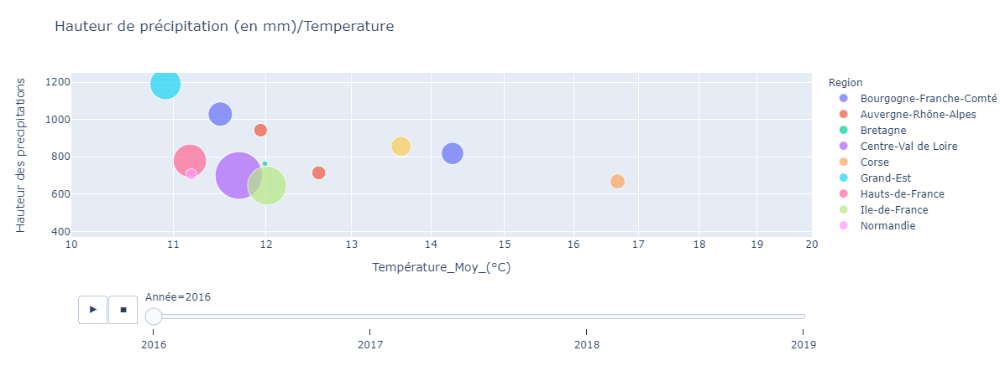

La hauteur des précipitations augmente avec la température dans la majorité des régions durant l’année 2018, cette observation ne permet pas d’affirmer que les précipitations sont plus importantes lorsqu’il fait plus chaud. Au contraire il semblerait qu’il y ait plus de précipitations lorsque la température diminue. D’autre part lorsque la hauteur des précipitations augmente le nombre de catastrophes naturelles augmente aussi.

### 4.2.3 Ensoleillement (en heures)/Temperature

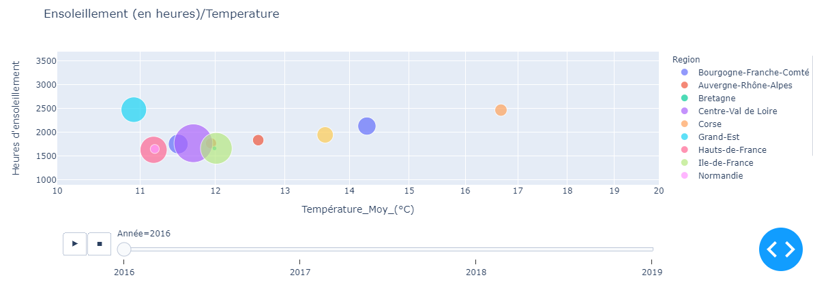

On ne remarque aucun lien direct entre l'ensoillement et la température. En effet, d'une année à l'autre lorsque la température augmente l'ensoillement diminue et vice versa. Ainsi, nous pouvons écarter l'hypothèse de l'influence de l'ensoleillement sur la température.

## 4.3.	 Page 3

Par ailleurs, la page 3 du Dashboard permet de visualiser l’évolution du nombre de catastrophes naturelles au cours des années. 
 
L’histogramme nous permet de dire que l’année 2018 marque le plus grand nombre de catastrophes naturelles. 

### 4.3.1 Nombre de catastrophes naturelles par année

Ensuite, la carte nous permet de voir les régions les plus affectées au cours du temps. Il suffit de sélectionner successivement les différentes années pour apercevoir les évolutions. 

## 4.3.2 Catastrophe naturelle chaque année

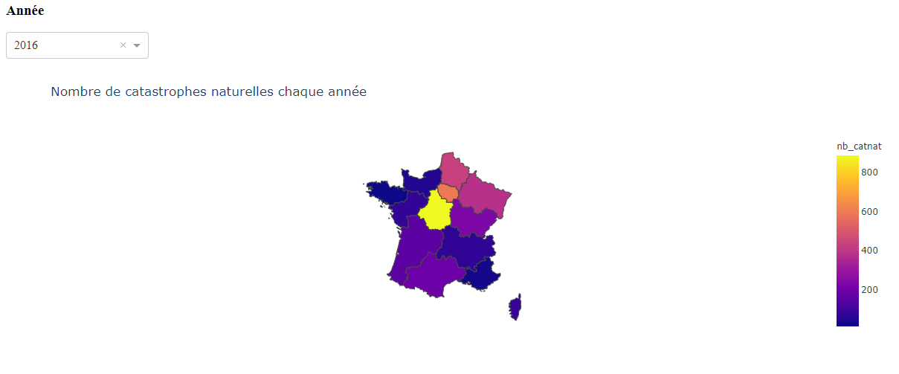

En 2016 la région la plus touchée est la région Centre-Val-de-Loire qui compte un peu moins de 900 catastrophes naturelles. Les régions du Nord-Est sont les secondes à être les plus atteintes avec un nombre de catastrophes naturelles oscillant entre 400 et 600. 
 
En 2O17, le nombre de catastrophes naturelles est inférieure à 800 et la région la plus frappée est l’Occitanie avec un effectif de 700. Par ailleurs, on remarque que les autres régions sont moins touchées et la quantité de catastrophes ne dépassent pas 200.
 
En 2018, le nombre maximum de catastrophes naturelles augmente fortement, celui-ci se situe à un peu plus de 1600, en effet l’Occitanie est toujours la région la plus atteinte mais le nombre de catastrophes naturelles augmentent dans les autres régions. Par exemple en Nouvelle-Aquitaine, on atteint 1200 cas.
 
En 2019,on remarque que la Bourgogne-Franche Compté compte le plus grand nombre de catastrophes naturelles. De surcroît, celles-ci sont plus répandu dans la majorité Est du pays. 
 
Finalement, en 2020, on remarque une diminution globale du nombre de catastrophes naturelles en France même si la région d’Occitanie demeure la plus affectée avec un peu plus de 700 cas.

### 4.3.3 Nombre de catastrophes par type

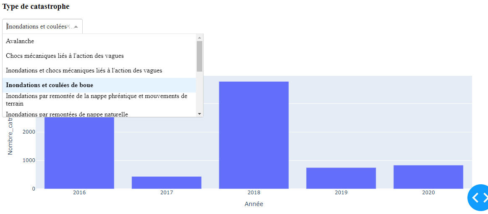

Le bar graph intitulé "Nombre de catastrophes par type” peut être mis en relation avec les animations de la page 2, particulièrement avec l’animation concernant la hauteur des précipitations. Nous avions pu voir précédemment que 2018 fut l’année où les précipitations étaient les plus fortes. On remarque grâce à cet histogramme qu’un grand nombre de catastrophes liées aux inondations se sont produites cette année là.

D’ailleurs, on peut mettre évidence que les régions les moins touché par les catastrophes naturelles les régions de Nord Ouest tandis que les régions les plus communément saisies sont les régions de sud et de l’Est.

La partie intitulée “Types” permet de spécifier les catastrophes et d’obtenir de nouveaux graphiques nous indiquant leur nombre en fonction des différentes années. Par exemple, on compte 90 catastrophes de type inondations par remontées de nappe phréatique en 2018, 10 en 2019 et 3 en 2020.

L'année la plus froide est essentiellement marqué par des inondations malgré tout moins nombreuses que les autres années. On peut donc peut être en déduire un lien entre la température et les catastrophes naturelles (on approfondira cela en 4e page du Dashboard). On Remarque globalement que les inondations et les coulées de boue ou mouvement de terrain sont les catastrophes naturelles présentent en plus grand nombre. 
 
D’ailleurs, on peut mettre évidence que les régions les moins touchées par les catastrophes naturelles sont les régions du Nord Ouest tandis que les régions les plus atteintes sont les régions du Sud et de l’Est.
 
En somme, sur cette page en peut voir que les catastrophes naturelles présentent en plus grand nombre sont en 2018, elles sont au cours du temps de plus en plus répandues sur le pays. De plus un lien entre catastrophes naturelles et températures commence à apparaître.

## 4.4.	 Page 4

### 4.4.1 Catastrophe naturelle par mois et température par mois

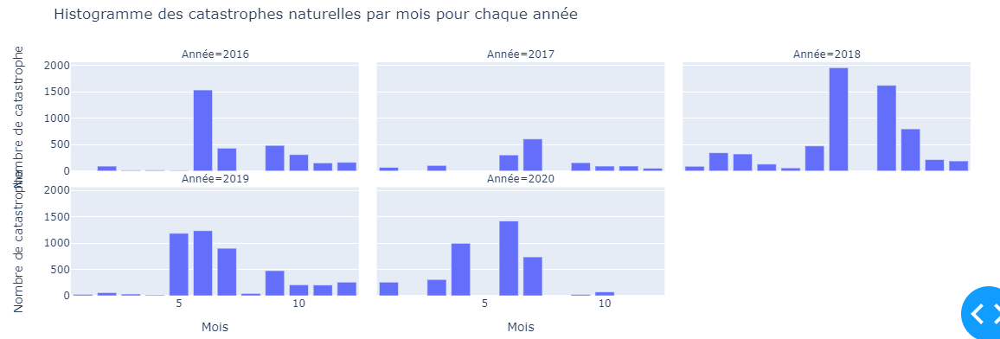

Enfin, la dernière page permet de répondre à notre problématique. 
En comparant le nombre de catastrophes naturelles en fonction des différentes années, on peut observer parallèlement les températures au cours du temps.
 
Cela nous permet de conclure que 2018 est toujours l’année la plus chaude. En juillet la température est plus élevée que les années précédentes. Entre autre, on peut établir que les catastrophes naturelles sont plus nombreuses aux mois les plus chauds de l’année. 
 
En dernier lieu, il nous est possible de conclure sur l’existence d’une relation entre le réchauffement climatique et le nombre de catastrophes naturelles en France.
